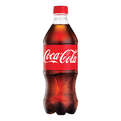

# Completed Foods

<!---->

 <div align="center"> 
    
 </div>

## [](../foodrp/textures/items/apple_pie.png) Apple Pie

```txt
Name: Apple Pie
Which crafting util: Crafting Table
How to make:
BBB
BAB
BBB
B=Bread
A=Apple
Effects: None
Stack Size: 64
How many hunger: 5 hunger
Notes: None
```


## [](../foodrp/textures/items/chocolate_milk.png) Chocolate Milk

```txt
Name: Chocolate Milk
Which crafting util: Crafting Table
How to make:
CSC
SMS
CSC
C=Cocoa Beans
M=Milk
S=Sugar
Effects: WIP
Stack Size: 64
How many hunger: 2 hunger
Notes: Returns Bucket
```

## [](../foodrp/textures/items/hot_chocolate.png) Hot Chocolate

```txt
Name: Hot Chocolate
Which crafting util: Furnace
How to make: Chocolate Milk
Effects: Fire Resistance 100% 2 mins amp 10
Stack Size: 64
How many hunger: 8 hunger
Notes: DOES NOT GIVE ANYTHING BACK
```

<!--## [](../foodrp/textures/items/coke.png) Coke-->
<h2>
 <a herf="../foodrp/textures/items/coke.png">
  
  Coke
 </a>
</h2>

```txt
Name: Coke
Which crafting util: Crafting Table
How to make:
Shapeless Recipe
Sweet Berries X1
Sugar X1
Water Bottle X1
Effects: Nause 100% 10 mins amp 250
Stack Size: 64
How many hunger: 20 hunger
Notes: None
```

## [](../foodrp/textures/items/raw_wafffle.png) Raw Waffle

```txt
Name: Waffle
Which crafting util: Crafting Table
How to make:
WWW
MSM
WWW
W=Wheat
M=Milk
S=Sugar
Effects: None
Stack Size: 64
How many hunger: 1 hunger
Notes: None
```

## [](../foodrp/textures/items/waffle.png) Waffle

```txt
Name: Waffle
Which crafting util: Furnace
How to make: Raw Waffle
Effects: Regeneration 100% 2 mins amp 10 and Speed 100% 2 mins amp 10
Stack Size: 64
How many hunger: 4 hunger
Notes: None
```

## [](../foodrp/textures/items/seasoning.png) Curry Powder

```txt
Name: Curry Powder
Which crafting util: Furnace
How to make: Beetroot
Effects: None
Stack Size: 64
How many hunger: -2 hunger
Notes: None
```

## [](../foodrp/textures/items/curry.png) Curry

```txt
Name: Curry
Which crafting util: Crafting Table
How to make: 
Shapeless Recipe
Curry Powder X2
Water Bucket X1
Cooked Chicken X1
Bowl X1
Effects: Fire Resistance 100% 15 sec amp 4
Stack Size: 64
How many hunger: 9 hunger
Notes: DOES NOT GIVE ANYTHING BACK
```

## [](../foodrp/textures/items/empty_mre.png) Empty MRE

```txt
Name: Empty MRE
Which crafting util: Crafting Table
How to make: 
LLL
L L
 B
L=Leather
B=Bowl
Effects: Hunger 100% 15 sec amp 2
Stack Size: 64
How many hunger: 1 hunger
Notes: None
```

## [](../foodrp/textures/items/mre.png) MRE

```txt
Name: MRE
Which crafting util: Crafting Table
How to make: 
Shapeless Recipe
Empty MRE X1
Cooked Beef X1
Bread X1
Effects: Regeneration 100% 30 sec amp 4 and Resistance 100% 30 sec amp 4
Stack Size: 64
How many hunger: 20 hunger
Notes: Returns Empty MRE
```

## [](../foodrp/textures/items/jerky.png) Jerky

```txt
Name: Jerky
Which crafting util: Furance
How to make: Rotten Flesh
Effects: None
Stack Size: 64
How many hunger: 6 hunger
Notes: None
```

## [](../foodrp/textures/items/ramen.png) Ramen

```txt
Name: Ramen
Which crafting util: Crafting Table
How to make:
Shapeless Recipe
Cooked Chicken X1
Egg X1
Dried Kelp X1
Bowl X1
Effects: Strength 100% 10 sec amp 4 and Resistance 100% 10 sec amp 4
Stack Size: 64
How many hunger: 11 hunger
Notes: None
```
