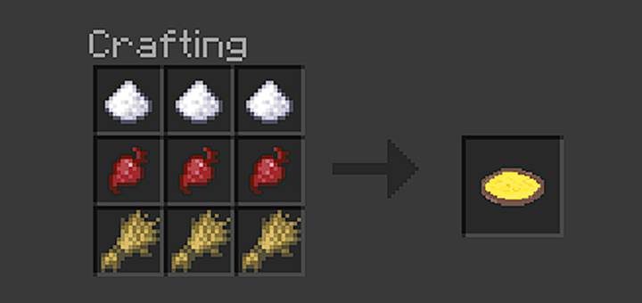
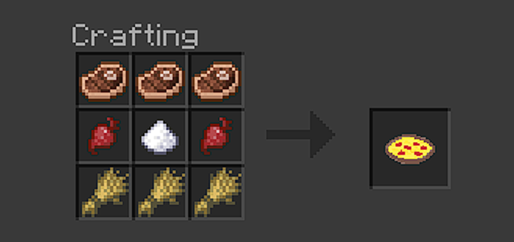

# Completed Foods

*Note that any screenshots use the [New Caledonia Shader](https://github.com/NewCaledoniaDevTeam/BETA_ShaderPack/releases), so some textures of the food items maybe off when compared with Vanilla Minecraft textures.


## [](../foodrp/textures/items/apple_pie.png) Apple Pie


[](images/apple_pie_recipe.png)

```txt
Name: Apple Pie
Which crafting util: Crafting Table
How to make:
BBB
BAB
BBB
B=Bread
A=Apple
Effects: None
Stack Size: 64
How many hunger: 5 hunger
Notes: None
```


## [](../foodrp/textures/items/chocolate_milk.png) Chocolate Milk


[](images/chocolate_milk_recipe.png)

```txt
Name: Chocolate Milk
Which crafting util: Crafting Table
How to make:
CSC
SMS
CSC
C=Cocoa Beans
M=Milk
S=Sugar
Effects: WIP
Stack Size: 64
How many hunger: 2 hunger
Notes: After eating, gives you bucket
```


## [](../foodrp/textures/items/hot_chocolate.png) Hot Chocolate


[](images/hot_chocolate_recipe.png)

```txt
Name: Hot Chocolate
Which crafting util: Furnace
How to make: Chocolate Milk
Effects: Fire Resistance 100% 2 mins amp 10
Stack Size: 64
How many hunger: 8 hunger
Notes: After eating, gives you bucket
```


<!--## [](../foodrp/textures/items/coke.png) Coke-->
<h2>
 <a herf="../foodrp/textures/items/coke.png">
  
 </a>
 Coke
</h2>

[](images/coke_recipe.png)

```txt
Name: Coke
Which crafting util: Crafting Table
How to make:
 B
 S
 W
B=Sweet Berries
S=Sugar
W=Water Bottle
Effects: Nause 100% 10 mins amp 250
Stack Size: 64
How many hunger: 20 hunger
Notes: After eating, gives you glass bottle
```


## [](../foodrp/textures/items/pepsi.png) Pepsi


[](images/pepsi_recipe.png)

```txt
Name: Pepsi
Which crafting util: Crafting Table
How to make:
 D
 S
 W
B=Blue Dye
S=Sugar
W=Water Bottle
Effects: Nause 100% 1 min amp 250 and Health Boost 100% 5 sec amp 250 and saturation 100% 5 sec amp 250
Stack Size: 64
How many hunger: 6 hunger
Notes: After eating, gives you glass bottle
```


## [](../foodrp/textures/items/raw_wafffle.png) Raw Waffle


[](images/raw_waffle_recipe.png)

```txt
Name: Raw Waffle
Which crafting util: Crafting Table
How to make:
WWW
MSM
WWW
W=Wheat
M=Milk
S=Sugar
Effects: None
Stack Size: 64
How many hunger: 1 hunger
Notes: Gives two buckets when created
```


## [](../foodrp/textures/items/waffle.png) Waffle


[](images/cooked_waffle.png)

```txt
Name: Waffle
Which crafting util: Furnace
How to make: Raw Waffle
Effects: Regeneration 100% 2 mins amp 10 and Speed 100% 2 mins amp 10
Stack Size: 64
How many hunger: 4 hunger
Notes: None
```


## [](../foodrp/textures/items/seasoning.png) Curry Powder


[](images/curry_powder_recipe.png)

```txt
Name: Curry Powder
Which crafting util: Furnace
How to make: Beetroot
Effects: None
Stack Size: 64
How many hunger: -2 hunger
Notes: None
```


## [](../foodrp/textures/items/curry.png) Curry


[](images/curry_recipe.png)

```txt
Name: Curry
Which crafting util: Crafting Table
How to make: 
PCP
 W
 B
P=Curry Powder
C=Cooked Chicked
W=Bucket
B=Bowl
Effects: Fire Resistance 100% 15 sec amp 4
Stack Size: 64
How many hunger: 9 hunger
Notes:
    - When Crafting, gives you bucket back
    - After eating, gives you bowl back
```


## [](../foodrp/textures/items/empty_mre.png) Empty MRE


[](images/empty_mre_recipe.png)

```txt
Name: Empty MRE
Which crafting util: Crafting Table
How to make: 
LLL
L L
 B
L=Leather
B=Bowl
Effects: Hunger 100% 15 sec amp 2
Stack Size: 64
How many hunger: 1 hunger
Notes: None
```


## [](../foodrp/textures/items/steak_mre.png) Steak MRE


[](images/steak_mre_recipe.png)

```txt
Name: Steak MRE
Which crafting util: Crafting Table
How to make: 
 M
 S
 B
M=Empty MRE
S=Cooked Beef
B=Bread
Effects: Regeneration 100% 30 sec amp 4 and Resistance 100% 30 sec amp 4
Stack Size: 64
How many hunger: 20 hunger
Notes: Returns Empty MRE
```


## [](../foodrp/textures/items/chicken_mre.png) Chicken MRE


[](images/chicken_mre_recipe.png)

```txt
Name: Chicken MRE
Which crafting util: Crafting Table
How to make: 
How to make: 
 M
 C
 B
M=Empty MRE
C=Cooked Chick
B=Bread
Effects: Regeneration 100% 30 sec amp 4 and Resistance 100% 30 sec amp 4
Stack Size: 64
How many hunger: 20 hunger
Notes: Returns Empty MRE
```


## [](../foodrp/textures/items/jerky.png) Jerky


[](images/jerky_recipe.png)

```txt
Name: Jerky
Which crafting util: Furance
How to make: Rotten Flesh
Effects: None
Stack Size: 64
How many hunger: 6 hunger
Notes: None
```


## [](../foodrp/textures/items/ramen.png) Ramen


[](images/ramen_recipe.gif)

```txt
Name: Ramen
Which crafting util: Crafting Table
How to make:
Shapeless Recipe
Cooked Chicken X1
Egg X1
Dried Kelp X1
Bowl X1
Effects: Strength 100% 10 sec amp 4 and Resistance 100% 10 sec amp 4
Stack Size: 64
How many hunger: 11 hunger
Notes: After eating, gives you bowl back
```


## [](../foodrp/textures/items/cheese.png) Cheese


[](images/cheese_recipe.gif)

```txt
Name: Cheese
Which crafting util: Crafting Table
How to make:
Shapeless Recipe 
Milk Bucket X3
Effects: None
Stack Size: 64
How many hunger: 10 hunger
Notes: Returns 9 Buckets
```


## [](../foodrp/textures/items/cheese_pizza.png) Cheese Pizza


[](images/cheese_pizza_recipe.png)

```txt
Name: Cheese Pizza
Which crafting util: Crafting Table
How to make: 
SSS
BBB
WWW
S=Sugar
B=Beetroot
W=Wheat
Effects: Fire Resistance 100% 1 min amp 250
Stack Size: 64
How many hunger: 10 hunger
Notes: None
```


## [](../foodrp/textures/items/pepperoni_pizza.png) Pepperoni Pizza


[](images/pepperoni_pizza_recipe.png)

```txt
Name: Pepperoni Pizza
Which crafting util: Crafting Table
How to make: 
EEE
BSB
WWW
S=Sugar
B=Beetroot
W=Wheat
E=Cooked Beef
Effects: Saturation 100% 40 sec amp 250 and Health Boost 100% 2 sec amp 250
Stack Size: 64
How many hunger: 10 hunger
Notes: None
```


## [](../foodrp/textures/items/vegan_pizza.png) Vegan Pizza


[](images/vegan_pizza_recipe.png)

```txt
Name: Vegan Pizza
Which crafting util: Crafting Table
How to make: 
KKK
SSS
BBB
K=Kelp
S=Wheat Seeds
B=Bread
Effects: Slowness 100% 3 mins amp 4 and Poison 100% 60 sec amp 4
Stack Size: 64
How many hunger: 6 hunger
Notes: None
```


## [](../foodrp/textures/items/cursed_pizza.png) Cursed Pizza


[](images/cursed_pizza_recipe.png)

```txt
Name: Cursed Pizza
Which crafting util: Crafting Table
How to make: 
WSK
ORF
PPP
W=Wheat
S=Sugar
K=Kelp
O=Oak Sapling
R=Rotten Flesh
F=Puffer Fish Bucket
P=Poisonous Potato
Effects: Nausea 100% 30 mins amp 250 and Slowness 100% 30 mins amp 250 and poison 100% 30 mins amp 250
Stack Size: 64
How many hunger: 40 hunger
Notes: None
```


## [](../foodrp/textures/items/baguette.png) Baguette


[](images/baguette_recipe.png)

```txt
Name: Baguette
Which crafting util: Crafting Table
How to make: 
  B
 B
B
B=Bread
Effects: None
Stack Size: 64
How many hunger: 9 hunger
Notes: None
```
